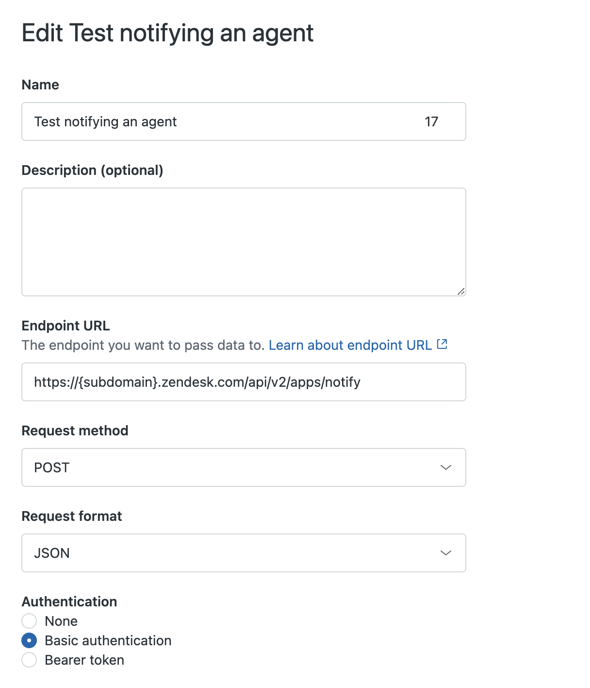
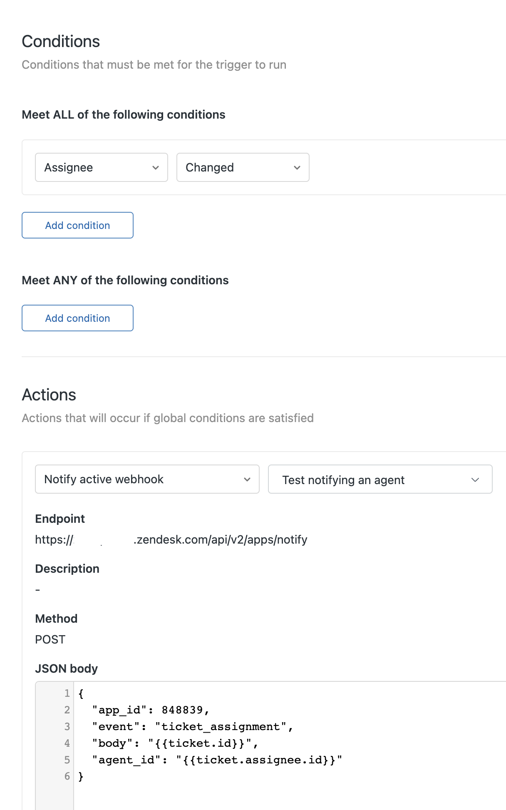

# Test notifying an agent

This background app demonstrates one approach that could be used to notify a specific agent that they have been assigned a ticket in Zendesk Support. This is achieved using notification events together with the notify REST API endpoint.

Through the use of triggers together with webhooks in Zendesk support, the app receives a notification via the notify REST API endpoint which contains the app ID, event ID, body, and agent_id properties. A custom event handler receives the event, which executes the notify action to generate a notification in the agent interface. This notification will be visible only to the agent who has been assigned the ticket.

## Getting started

Follow these steps to get a local copy up and running.

### Prerequisites

- Zendesk Command Line (ZCLI)

[Using Zendesk Command Line](https://developer.zendesk.com/documentation/apps/app-developer-guide/zcli/#installing-and-updating-zcli)

### Installation

1. Clone the repo

```
git clone https://github.com/zendesk/example.git
```

2. Package and install the app

```
zcli apps:create
```

[Packaging and installing a private Zendesk app](https://developer.zendesk.com/documentation/apps/app-developer-guide/zcli/#packaging-and-installing-a-private-zendesk-app)

3. Create a webhook to call the notify API endpoint



[Creating webhooks in Admin Center](https://support.zendesk.com/hc/en-us/articles/4408839108378-Creating-webhooks-in-Admin-Center)

4. Create a trigger to notify webhook when ticket assignment occurs. You will need to provide the specific app_id value of your app to the JSON body.



<!-- Links to relevant resources such as help center articles or dev docs -->

## Additional Resources

- [Zendesk Apps Guide](https://developer.zendesk.com/documentation/apps/)
- [Apps Support API documentation](https://developer.zendesk.com/api-reference/apps/apps-support-api/introduction/)
- [Sending Notifications to an App](https://developer.zendesk.com/api-reference/ticketing/apps/apps/#send-notification-to-app)
- [ZAF notify action documentation](https://developer.zendesk.com/api-reference/apps/apps-support-api/all_locations/#notify)

<!-- Issue reporting with link to repo issues page -->

## Issues

You can [create an issue on Github](https://github.com/zendesk/example/new),
reach out in our [Developer Community](https://support.zendesk.com/hc/en-us/community/topics),
or report the issue in the [Zendesk Developers Slack group](https://docs.google.com/forms/d/e/1FAIpQLScm_rDLWwzWnq6PpYWFOR_PwMaSBcaFft-1pYornQtBGAaiJA/viewform).
